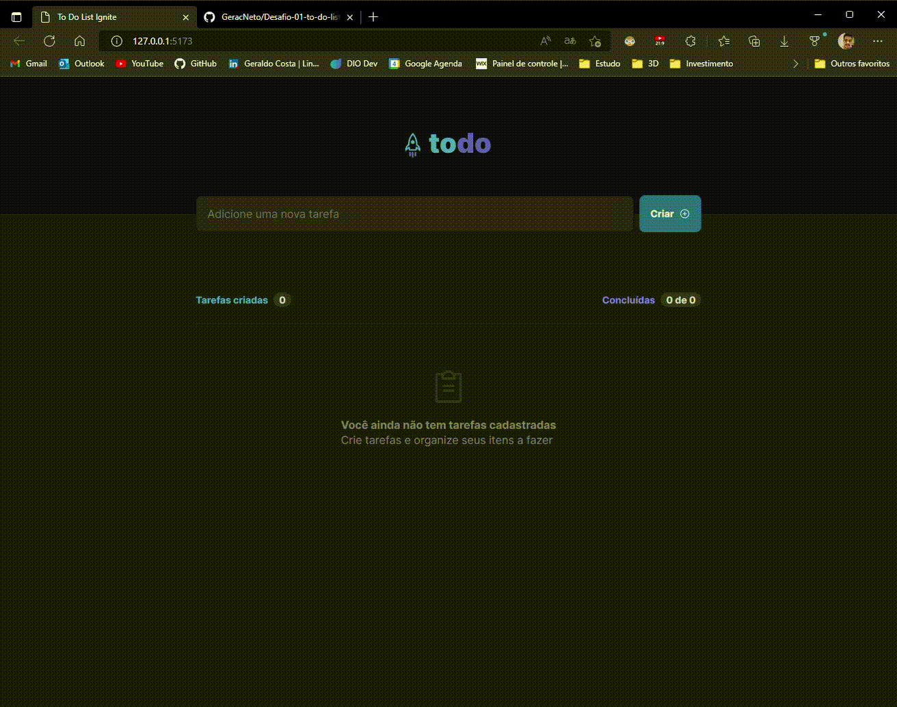
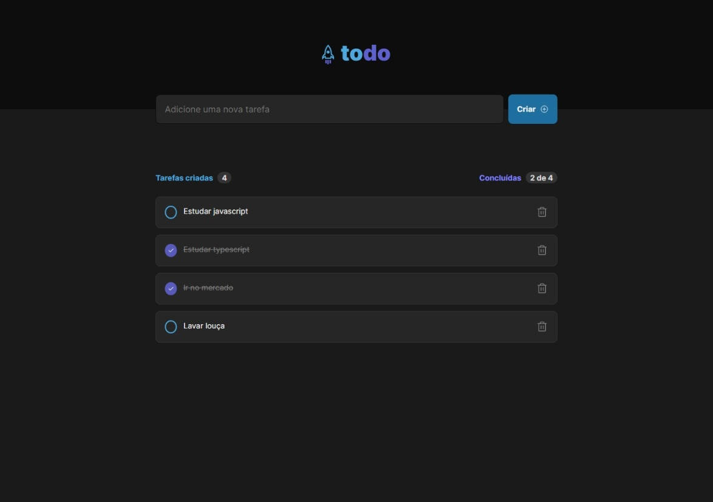
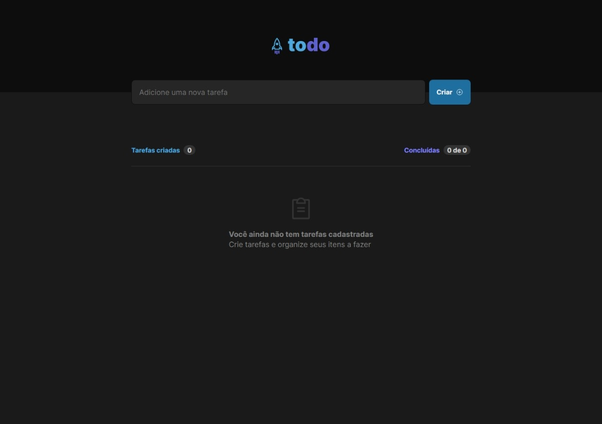

# Desafio "to-do-list" dos conceitos do primeiro módulo do curso Ignite de Reactjs - Rocketseat

## Projeto

<div>

</div>





# Install

Clone this repository and install it dependencies with this command:
```sh
$ npm install
```
Run the application with npm run dev command, it will start the app:
```sh
$ npm run dev
```
